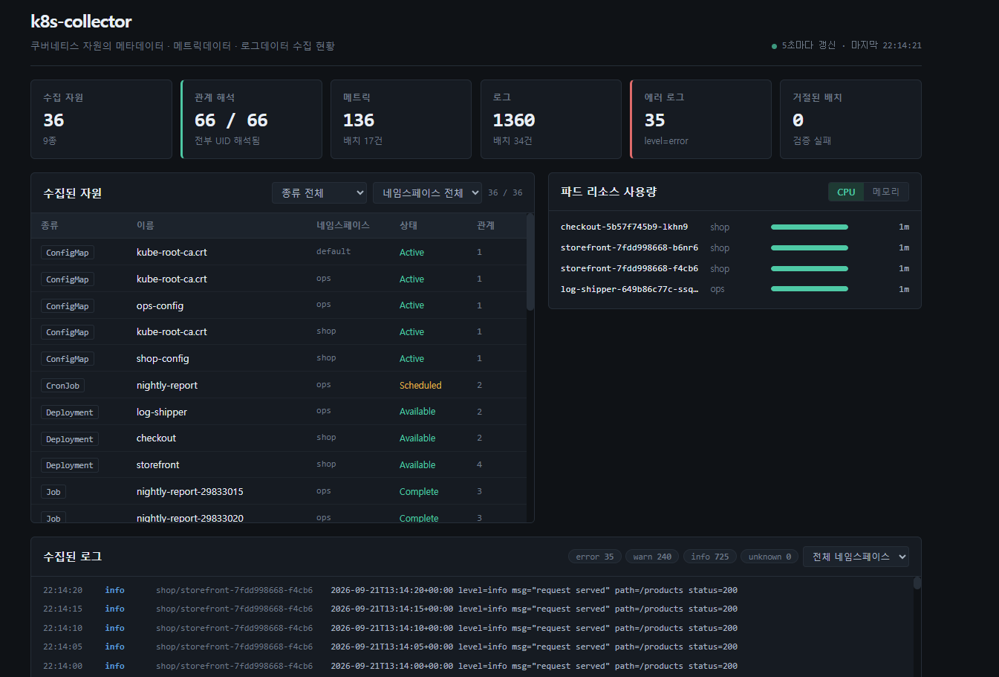

# k8s-collector

[](https://github.com/pxvnc1617/grpc-kubernetes-collector/actions/workflows/ci.yml)
[](https://go.dev)
[](https://grpc.io)
[](https://vuejs.org)

쿠버네티스 자원의 **메타데이터 · 메트릭데이터 · 로그데이터**를 수집해 gRPC 스트리밍으로
서버에 전송하고, 수집 현황을 대시보드로 보여준다.

```
kind 클러스터                수집 에이전트                 수집 서버              대시보드
──────────────              ──────────────               ──────────           ──────────
Deployment                   client-go
ReplicaSet    ──────────▶    ├ 메타    ──┐
Pod                          ├ 메트릭  ──┤ gRPC          검증 ─ 집계
ConfigMap                    └ 로그    ──┘ client         이름→UID 해석  ──▶  Vue 3 SPA
Secret                                     streaming      메모리 보관        HTTP/JSON
CronJob · Job                                  :50051                          :8080
```

**실무에서는 수집 결과를 Kafka 로 발행했다.** 메시지 브로커를 거치지 않고 에이전트와
서버가 직접 통신한다면 전송 계층을 어떻게 설계해야 하는지 확인해 보려고 만들었다.



수집 현황 · 자원과 관계 · 파드 리소스 사용량 · 로그를 한 화면에서 본다.
**관계 해석 66/66** 처럼 미해석이 남으면 바로 보이므로, 수집 대상에서 빠진
자원 종류를 그 자리에서 알아챌 수 있다.

---

## 바로 띄워 보기

```bash
make cluster      # kind 클러스터 + metrics-server + 샘플 워크로드
make run-server   # gRPC :50051, 대시보드 http://localhost:8080
make run-agent    # 20초 주기 수집 (다른 터미널)
```

`make run-server` 하나로 수집 서버와 대시보드가 같이 뜬다. 별도 웹 서버가 필요 없다.

### 클러스터에 올려서 돌리기

`make deploy` 하면 수집기가 **자기가 올라간 클러스터를 수집한다.**

```bash
make cluster    # kind 클러스터 (NodePort 용 포트 매핑 포함)
make deploy     # 이미지 빌드 → kind 적재 → 배포
```

```
collector 네임스페이스
├ ServiceAccount + ClusterRole + ClusterRoleBinding   (agent · node-agent · prometheus 각각)
├ ConfigMap            클러스터 식별자
├ Deployment  server       gRPC :50051 · HTTP :8080
├ Deployment  agent        in-cluster 인증 (ServiceAccount 토큰)
├ DaemonSet   node-agent   노드 cgroup 직접 수집
├ Deployment  prometheus   수집기 지표 스크랩 + 경보
├ Service     ClusterIP
├ Service     NodePort 30080   대시보드
└ Service     NodePort 30090   Prometheus
```

대시보드는 `http://localhost:30080`, Prometheus 는 `http://localhost:30090`.
포트 매핑 없이 만든 클러스터라면 `kubectl -n collector port-forward` 를 쓴다.

```bash
kubectl -n collector port-forward svc/collector-server 8080:8080
kubectl -n collector port-forward svc/prometheus       9090:9090
```

---

## 배포에서 내린 판단

### cluster-admin 을 붙이지 않았다

수집기는 읽기만 하므로 필요한 자원과 동사만 골랐다. `watch` 도 지금은 쓰지 않아 뺐다.

```yaml
- apiGroups: [""]
  resources: [namespaces, pods, configmaps, secrets, serviceaccounts]
  verbs: ["get", "list"]
- apiGroups: [""]
  resources: ["pods/log"]
  verbs: ["get"]
```

다만 **RBAC 은 "Secret 의 메타만 읽기" 같은 구분을 제공하지 않는다.**
`get` 권한이 곧 값 접근이다. 그래서 수집 코드에서 `Data` 를 담지 않는 것으로
경계를 지키고, 매니페스트 주석에 그 이유를 남겼다.

### 수집 경로가 다르면 배포 형태도 다르다

같은 "파드 CPU·메모리" 라도 어디서 재느냐에 따라 값도, 떠야 할 모양도 다르다.

| | `agent` | `node-agent` |
|---|---|---|
| 배포 | **Deployment 1개** | **DaemonSet N개** |
| 경로 | API 서버 경유 | 노드 `/sys/fs/cgroup` 직접 |
| 범위 | 클러스터 전체 | 그 노드의 컨테이너만 |
| 값 | metrics-server 가 집계한 값 | 커널 카운터 원본 |
| 권한 | ClusterRole (읽기) | ClusterRole + **hostPath** |

`agent` 를 DaemonSet 으로 띄우면 같은 자원을 노드 수만큼 중복 수집한다.
반대로 `node-agent` 를 Deployment 로 띄우면 한 노드만 보게 된다.

실제로 두 경로의 수집량이 다르게 나온다.

```
cpu_usage_millicores                7건    수집 대상 네임스페이스만
cgroup_cpu_usage_nanoseconds_total 13건    노드의 모든 컨테이너 (kube-system 포함)
```

### cgroup 에서 파드를 알아내는 법

cgroup 은 파드 UID 만 준다. 이름과 네임스페이스는 API 서버에서 받아 이어야 한다.
그런데 **경로에 박힌 UID 는 그대로 쓸 수 없다.**

```
/sys/fs/cgroup/memory/kubelet.slice/kubelet-kubepods.slice/
  kubelet-kubepods-besteffort.slice/
    kubelet-kubepods-besteffort-pod6d93af47_0ee3_4b96_bb9a_8952ed07be29.slice/
                                └──────── 하이픈이 밑줄로 바뀌어 있다 ────────┘
      cri-containerd-91f8a99d....scope/
        memory.usage_in_bytes
```

systemd 는 슬라이스 이름에 하이픈을 못 쓰므로 밑줄로 바꿔 넣는다.
되돌리지 않으면 쿠버네티스가 아는 UID 와 이어지지 않고, **메트릭은 수집되는데
어느 파드 것인지 알 수 없게 된다.**

처음 구현에서는 `"pod"` 를 찾아 잘랐는데, `kubelet-kube`**pod**`s.slice` 의
`pod` 에도 걸려 QoS 슬라이스를 파드로 오인했다. 테스트가 잡아 줬다.

```
podUIDFromSlice("kubelet-kubepods.slice")
     got  "s"        ← UID 로 "s" 가 들어갔다
     want ""
```

`-pod` 경계와 UID 형식(8-4-4-4-12 16진수)을 함께 검사하도록 고쳤다.

### replicas 는 1 이다

저장소가 메모리라 늘리면 에이전트가 붙은 파드에만 데이터가 쌓이고,
대시보드 값이 요청마다 달라진다. 외부 저장소로 빼기 전에는 늘리면 안 된다.

### 기동 순서 문제를 만나 고쳤다

쿠버네티스에 올리자 에이전트가 **매번 한 번씩 죽고 재시작**했다.

```
ERROR health check failed
      dial tcp 10.96.241.150:50051: connect: connection refused
→ Exit Code 1 → 재시작 → 두 번째에 성공
```

에이전트가 서버보다 먼저 떠서 health check 에 실패하고 종료한 것이다.
쿠버네티스가 재시작해 주므로 결과적으로는 돌아가지만, **서버가 재기동될 때마다
CrashLoopBackOff 로 빠져 복구가 지수적으로 늦어진다.**

즉시 종료 대신 **지수 백오프로 기다리게** 바꿨다.

```
1s → 2s → 4s → 8s → 16s (상한) … 최대 2분
```

서버를 지우고 에이전트만 띄워 재현했고, **8번째 시도에 연결 · 재시작 0회**를 확인했다.

```
{"level":"WARN","msg":"server not ready, retrying","attempt":1,"retry_in":"1s"}
{"level":"WARN","msg":"server not ready, retrying","attempt":5,"retry_in":"16s"}
{"level":"INFO","msg":"connected","server_version":"v0.2.0","attempts":8}
```

### 지표를 내는 데서 멈추지 않았다

`/metrics` 를 여는 것만으로는 "노출했다" 일 뿐이다.
실제로 긁히는지, 긁힌 값으로 경보가 뜨는지까지 봐야 관측 가능하다고 말할 수 있다.
그래서 Prometheus 를 클러스터에 같이 올렸다.

대상은 이름으로 박지 않고 애너테이션으로 찾게 했다.
파드가 늘거나 이름이 바뀌어도 설정을 고칠 일이 없다.

```yaml
annotations:
  prometheus.io/scrape: "true"
  prometheus.io/port: "8080"     # 없으면 파드의 첫 포트(gRPC)로 긁으러 간다
  prometheus.io/path: "/metrics"
```

경보는 셋이다. 모두 **"조용히 잘못되는 것"** 을 겨냥했다.

| 경보 | 무엇을 잡는가 |
|---|---|
| `CollectorItemsRejected` | 에이전트와 서버의 기대가 어긋났다 — 스트림은 살아 있어 안 보인다 |
| `CollectorRelationsUnresolved` | 수집 대상에서 빠진 자원 종류가 있다 |
| `CollectorAgentSilent` | 에이전트가 죽어도 서버는 멀쩡히 떠 있다 |

### 그 경보가 바로 내 버그를 잡았다

Prometheus 를 올리자마자 `CollectorRelationsUnresolved` 가 떴다.

```
collector_relations_total     108
collector_relations_resolved  107
```

남은 하나를 찾아보니 이것이었다.

```
Pod collector/collector-node-agent-bvscw
  --PARENT_CHILD--> DaemonSet collector/collector-node-agent
```

바로 앞 단계에서 `node-agent` 를 DaemonSet 으로 올려놓고,
**정작 DaemonSet 을 수집 대상에 넣지 않았다.**
Deployment 는 중간에 ReplicaSet 이 있어 그쪽만 챙기면 됐지만,
DaemonSet·StatefulSet 은 파드가 바로 가리킨다.

대시보드만 봤으면 몰랐다. 관계가 하나 적게 보일 뿐 아무것도 안 깨진다.

DaemonSet·StatefulSet 수집을 추가하고 RBAC 도 함께 열었다.
고친 뒤 **117/117 · 경보 전부 해제**를 확인했다.

테스트는 종류를 나열하는 대신 불변식으로 뒀다.

```go
// "수집된 파드의 부모는 모두 수집된 자원 안에 있어야 한다"
// 종류가 늘어도 테스트를 고칠 필요가 없고, 이번 같은 누락은 바로 걸린다.
func TestCollectMeta_PodOwnersAreCollected(t *testing.T)
```

---

## 무엇을 수집하는가

| 종류 | 대상 | 방법 |
|---|---|---|
| **메타데이터** | Namespace · Deployment · ReplicaSet · Pod · CronJob · Job · ConfigMap · Secret · ServiceAccount | `client-go` |
| **메트릭데이터** | 파드별 CPU(millicores) · 메모리(bytes) | `metrics-server` |
| **로그데이터** | 파드 컨테이너 최근 로그 + 수준 추출 | `GetLogs` |

Secret 은 **값을 수집하지 않는다.** 이름 · 타입 · 키 개수만 본다.

---

## 설계 의도

### 이름으로 적힌 참조를 UID 로 잇는다

이 프로젝트에서 가장 공들인 부분이다.

쿠버네티스에서 자원 간 참조는 **UID 가 아니라 "이름" 으로 적힌다.**
워크로드 스펙의 `envFrom.configMapRef.name` 에는 이름만 있고, 그 ConfigMap 의
UID 는 스펙 어디에도 없다. 수집 시점에는 대상의 UID 를 알 수 없다.

```go
// 수집 단계 — 이름만 담아 보낸다
&collectorv1.Relation{
    Type:            RelDependency,
    TargetKind:      "ConfigMap",
    TargetName:      "shop-config",
    TargetNamespace: "shop",
    // TargetUid 는 비워 둔다
}
```

그래서 **서버가 전체 자원을 받은 뒤** `namespace|kind|name` 역인덱스를 만들어 해석한다.
참조 대상이 같은 배치에 없을 수 있으므로, 해석은 **스트림이 닫힌 다음**에 일어난다.

참조가 들어올 수 있는 경로는 네 군데다. 하나라도 빠지면 관계가 조용히 누락된다.

- `envFrom.configMapRef` / `envFrom.secretRef`
- `env[].valueFrom.configMapKeyRef` / `secretKeyRef`
- `volumes[].configMap` / `volumes[].secret`
- `spec.serviceAccountName`

### 소유 관계와 참조 관계를 구분한다

| | 관계 | UID |
|---|---|---|
| **소유** `PARENT_CHILD` | Namespace → Pod, Deployment → ReplicaSet → Pod | `ownerReferences` 에 이미 있음 |
| **참조** `DEPENDENCY` | Pod → ConfigMap · Secret · ServiceAccount | **이름만 있음 → 해석 필요** |

ReplicaSet 과 Job 을 수집하지 않으면 소유 체인이 끊긴다.
파드의 `ownerReferences` 는 Deployment 가 아니라 **ReplicaSet** 을 가리키기 때문이다.

> 실제로 처음엔 ReplicaSet · Job 을 빼먹어 **6건이 미해석**으로 남았다.
> 대시보드에 미해석 개수가 보였기 때문에 찾을 수 있었다.

### 메타 · 메트릭 · 로그를 하나의 RPC 로 뭉개지 않는다

성격이 다르다. 메타는 스펙과 관계, 메트릭은 수치, 로그는 텍스트다.
검증 규칙도 달라야 한다.

```protobuf
rpc ReportMeta  (stream MetaBatch)   returns (ReportSummary);
rpc ReportMetric(stream MetricBatch) returns (ReportSummary);
rpc ReportLog   (stream LogBatch)    returns (ReportSummary);

rpc Subscribe(SubscribeRequest) returns (stream CollectTarget);  // 대상 푸시
rpc Health   (HealthRequest)    returns (HealthResponse);        // 기동 확인
```

### 부분 실패가 스트림 전체를 끊지 않는다

수집기는 무인으로 돈다. 대상 하나가 잘못됐다고 전체 전송이 멈추면 안 된다.

```go
if reason := validateMeta(batch); reason != "" {
    rejected += int64(len(batch.GetResources()))
    c.log.Warn("meta batch rejected", "reason", reason, ...)
    continue        // ← return 이 아니다. 스트림은 유지한다
}
```

거절된 개수는 버려지지 않고 `ReportSummary.rejected` 에 담겨 에이전트로 돌아간다.
**조용히 사라지는 데이터가 없어야** 무엇을 놓쳤는지 알 수 있다.

같은 이유로 로그 수준을 못 뽑은 줄도 버리지 않고 `unknown` 으로 남긴다.
버리면 어떤 형식을 놓쳤는지 영영 모른다.

### 수집 주기는 서버가 쥔다

에이전트를 재배포하지 않고 수집 빈도를 바꾸기 위해서다.
에이전트는 자신이 수집 **가능한** 대상을 알리고, 서버가 **주기와 활성 여부**를 내려준다.

구독 스트림은 서버가 푸시용으로 계속 열어 두므로 `io.EOF` 가 오지 않는다.
**전송과 컨텍스트를 공유하면 둘이 함께 데드라인에 걸린다.**
그래서 구독은 별도 고루틴으로 분리하고, 초기 목록만 `waitInitial(2s)` 로 기다린다.

---

## 검증

```bash
make test
```

| 패키지 | 커버리지 | 주요 테스트 |
|---|---|---|
| `internal/api` | 97.4% | 필터 · 정렬 · 집계 · 400 응답 |
| `internal/server` | 69.3% | **거절 후에도 스트림 생존**, 뒤늦게 온 참조 해석, 주기 푸시 |
| `internal/store` | 50.7% | 이름→UID 해석, **네임스페이스 격리**, 보존 한도 |
| `internal/collector` | 63.1% | **참조 4경로 추출 · 중복 제거**, **cgroup 경로 파싱**, 시스템 네임스페이스 제외, 로그 수준 |

- gRPC 는 **bufconn** 으로 메모리 위에 실제 서버를 띄워 테스트한다. 목이 아니라 진짜 스택을 통과한다.
- 쿠버네티스는 **fake clientset** 을 쓴다. 클러스터 없이 수집 로직을 검증한다.
- CI 는 거기서 멈추지 않고 **kind 클러스터를 실제로 띄워** 수집을 한 번 돌린다.
  자원 20건 이상, 거절 0건, **미해석 관계 0건**을 통과 조건으로 건다.

---

## 실행 결과

```
$ go run ./cmd/agent -once
{"msg":"connected","server_version":"v0.2.0"}
{"msg":"collect targets","targets":["meta/all","metric/pod","log/pod"]}
{"msg":"meta sent",  "resources":34,"batches":1,"rejected":0,"elapsed_ms":1}
{"msg":"metric sent","metrics":8,  "batches":1,"rejected":0,"elapsed_ms":0}
{"msg":"log sent",   "entries":80, "batches":2,"rejected":0,"elapsed_ms":1}

$ curl -s localhost:8080/api/summary | jq '.relations'
{ "total": 60, "resolved": 60 }
```

---

## 구조

```
proto/collector.proto          서비스 정의
cmd/server                     수집 서버 (gRPC + HTTP + 대시보드 서빙)
cmd/agent                      수집 에이전트 — Deployment · API 서버 경유
cmd/node-agent                 노드 수집기 — DaemonSet · cgroup 직접
internal/collector             client-go 수집 — 메타 · 메트릭 · 로그 · cgroup
internal/server                gRPC 서비스 구현 + 배치 검증
internal/store                 메모리 저장소 + 이름→UID 해석
internal/api                   조회 HTTP/JSON API
internal/metrics               수집기 자체 지표 (Prometheus)
web/                           Vue 3 대시보드 (Vite)
deploy/k8s/                    클러스터 배포 매니페스트
deploy/sample-workloads.yaml   수집 대상 샘플
.github/workflows/ci.yml       테스트 · 빌드 · kind E2E
```

---

## 범위와 한계

- **저장소는 메모리다.** 실제 제품이라면 적재기가 Kafka 를 소비해
  MariaDB · OpenSearch · Prometheus 로 라우팅한다. 여기서는 전송 계층과
  수집 정확성을 보는 것이 목적이라 저장은 메모리로 한정했다.
- **인증(mTLS)과 재시도 백오프는 없다.**
- **부하 측정을 하지 않았다.** 처리량 수치를 제시할 수 없다.
- 수집 주기가 겹칠 때의 중복 수집 방지(single-flight)는 넣지 않았다.
- 메트릭은 metrics-server 에 의존한다. 설치되지 않은 클러스터에서는
  메타와 로그만 수집하고 경고를 남긴 뒤 계속 진행한다.
